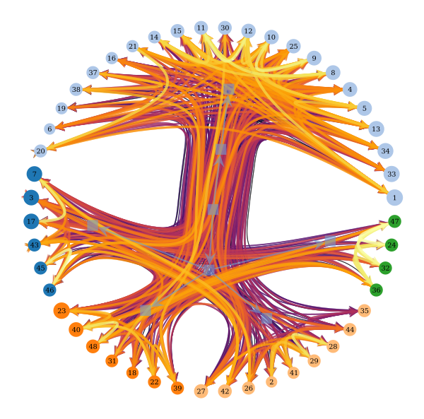
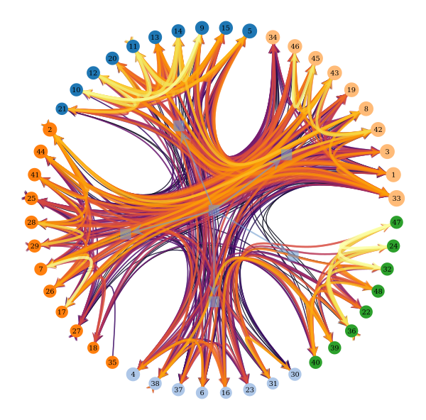
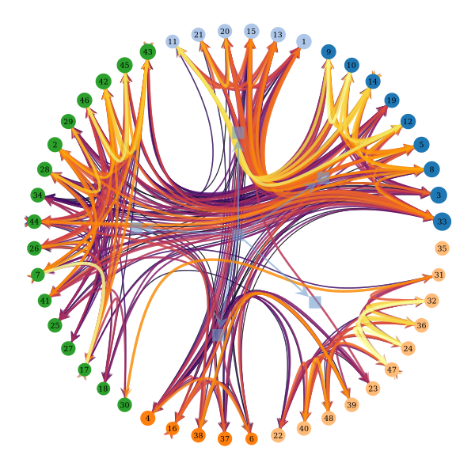
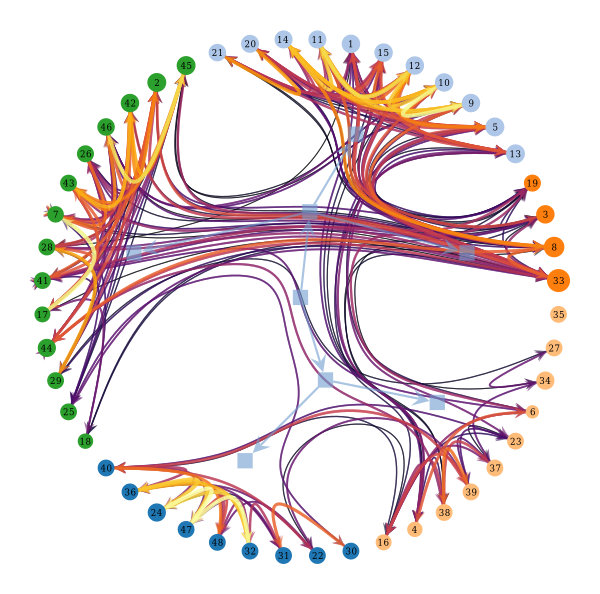
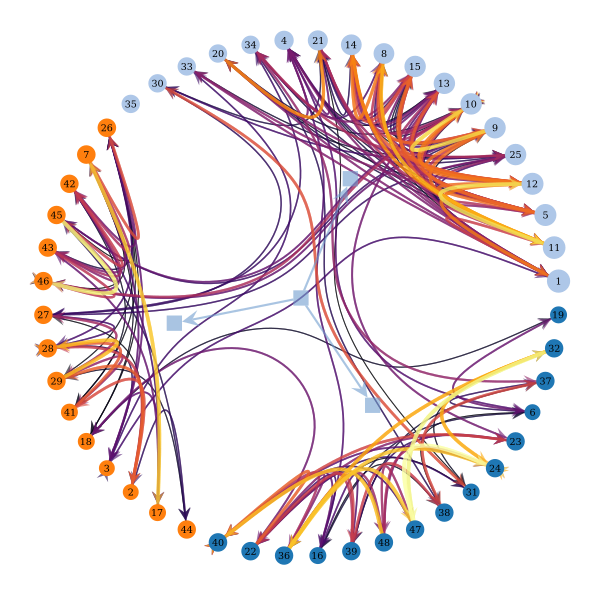
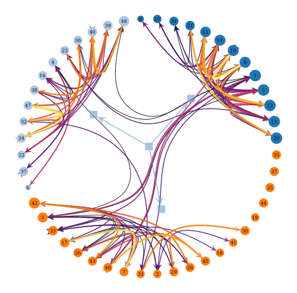

# Analytical Pipeline: Functional Clustering and Structural Refinement

This pipeline outlines the concrete steps followed in the **Neurobridge** project to identify clusters of functionally coherent brain regions and integrate structural data through equitable refinement of anatomical connectivity.

---

## **Step 1: Data Preprocessing**

**Input**: CSV fMRI data from a public dataset (HNU1)  
**Output**: Session-wise functional connectivity matrices

- Load 10 functional matrices (one per session)
- Each matrix corresponds to a 48x48 correlation matrix across brain regions

---

## **Step 2: Functional Clustering**

**Input**: One graph per functional session  
**Output**: Set of node partitions, one per session

- Build a graph from each functional matrix using a percentile-based threshold
- Run community detection (Nested SBM) on each graph
- Store resulting group assignments per session

---

## **Step 3: Session Selection**

**Input**: 10 sets of group assignments (one per session)  
**Output**: Representative session and its functional partition

- Compute pairwise Fowlkes–Mallows similarity between all session partitions
- Select the session with the highest mean similarity to the others
- Use its graph and partition as the functional reference

---

## **Step 4: Graph Visualization**

**Input**: Functional graph and clustering result  
**Output**: PDF visualizations

- Plot the raw functional graph after thresholding
- Plot the clustered graph using graph-tool's state-drawing and inferred layout
- Include vertex labels and edge weights

---

## **Step 5: Structural Integration**

**Input**: 10 structural matrices (connectomes) and functional partition  
**Output**: Equitable matrix \( A_k \)

- Average the 10 structural matrices to obtain \( A_0 \)
- Solve a convex optimization problem to find \( A_k \), the closest symmetric matrix to \( A_0 \) that is equitable w.r.t. the functional partition
- Save both \( A_0 \) and \( A_k \) to disk

---

## **Outputs**

All outputs are saved in `results/subject-<ID>/`:

- `graph_thresh-XX_directed.pdf`: Raw functional graph
- `graph_nested_clustered.pdf`: Clustered graph after SBM
- `functional_partition.csv`: Final partition used for structural refinement
- `A0_structural_mean.csv`: Mean structural matrix across sessions
- `Ak_structural_equitable.csv`: Optimized equitable matrix

---

## **Tools & Libraries**

- **Data Handling**:  
  - `numpy`, `pandas`, `cvxpy`

- **Graph Construction & Clustering**:  
  - `graph-tool` — for graph representation and stochastic block model inference

- **Clustering Evaluation**:  
  - `scikit-learn` — for Fowlkes–Mallows index

- **Visualization**:  
  - `matplotlib`, `graph-tool`

---

## Notes
This pipeline prepares the necessary inputs for the final phase of the Baruzzi et al. framework: dynamic simulation and synchronization validation — not implemented here.

---

## Results

As a conclusive stage of this project, we evaluate the functional clustering outcomes across different graph construction thresholds. This analysis focuses on a single subject and provides tangible insights into the community structure, even without proceeding to the dynamical modeling phase described in Baruzzi et al.

We run the entire pipeline — including clustering and equitable structural refinement — on the same subject while varying the percentile threshold used to build the functional graph. Below are the clustered graphs obtained using Nested SBM, shown for six different thresholds.

### Clustered Functional Graphs (Nested SBM)

#### Threshold = 0.5

- Very dense connectivity results in numerous overlapping connections.
- Many small communities are detected, though their separation is visually ambiguous.
- Harder to interpret due to potential noise retained from low correlations.

#### Threshold = 0.6

- Still highly connected, but some structure begins to emerge.
- Community separation becomes clearer, but overlaps are frequent.
- Appears to balance density and clarity better than 0.5.

#### Threshold = 0.7

- Well-balanced sparsity and structure.
- Clear, distinguishable clusters with distinct inter-group links.
- Likely a good compromise between noise reduction and community preservation.

#### Threshold = 0.8

- Less dense, and the modular structure is now crisp and easy to read.
- Cluster boundaries align well with visibly distinct edge bundles.
- Appears to match best with expectations for functional clustering.

#### Threshold = 0.85

- Graph is increasingly sparse, and some nodes show limited connectivity.
- While communities are still identifiable, fragmentation begins to occur.
- Some weakly connected areas lose detail.

#### Threshold = 0.9

- Extremely sparse, only the strongest connections remain.
- Communities are sharply defined, but peripheral or minor structures are lost.
- Risk of oversimplification — too few links to reflect full functional complexity.

### Final Notes
This result set provides a concrete basis to assess how thresholding affects brain parcellation. The most informative graphs appear in the 0.7–0.8 range, where clusters are both interpretable and structurally meaningful. These figures offer an alternative to dynamic simulation for evaluating whether functionally coherent communities are being captured.

